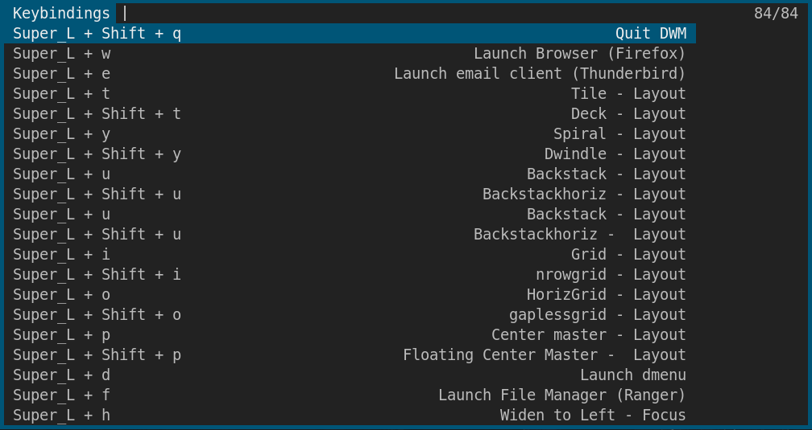

# README
 
This repository contains my implementation of a script that projects all the DWM's keybindings in a simple menu. The rationale behind the script was that I should be able to gather all the keybindings together in a simple inteface, without having any extra files, except from the script. The solution for me was to create a parser that reads the **config.def.h** file of DWM and subsequently projects the keybindings with dmenu or rofi (or any other menu).  The parser is written in bash and AWK.

## Dependecies

+ `bash` 4 (For associative arrays)
+ `awk`
## What can it read

The caveat is that config.def.h must be formatted in a certain way but alas, is not that different from the bare build. Until this version (0.1) the dwmKeyMenu can read  

+ plain keybindings 

+ media/funtion buttons ( i.e XF86XK\_AudioMute)

+ TAGKEYS from macro definition of TAGKEYS

## How can it read

The config.def.h path is given as an argument to the main.sh.

The final keybinding record is comprised of the Modkeys, the actual key and the Description of the keybinding. The Modkeys get automatically translated to the actual buttons (if they exist) i.e. Super\_L, as they are defined in xmodmap. The decription must be in a formated comment at the end of the line. Note the spaces and the commas between the parts. The Modkeys must be in the 2nd column and the key must be on the 3rd. Columns can be separated with spaces or tabs.

In order to read *plain keybindings* the keybindings must be formatted in the config.def.h file as 

```C
        { MODKEY|ShiftMask,             XK_q,      quit,           {0} },                       /* Quit DWM  */
	{ MODKEY,                       XK_t,      setlayout,      {.v = &layouts[0]} },        /* Tile - Layout */
```

In order to read media/function keys the keybindings must be formated in the config.def.h file as

```C
{ 0,              XF86XK_AudioMute,             spawn,     SHCMD("amixer -D pulse sset Master  toggle") },  /* Toggle Mute - Volume*/
```

NOTE: If instead of 0 in the Modkey column there was a `NULL,` it would still work. There must be something (without the comma) less than 5 characters.

TAGKEYS are read first to count how many TAGS there are; and what KEY are you using for each one. Then macro definition is read. Note that the comment is before the backslash "\\" character in order to be compiled. I am a bit skeptical about the coding practice I devised to put comments in a line separated macro definition but it works.

```C
#define TAGKEYS(KEY,TAG) \
         { MODKEY,                       KEY,      view,           {.ui = 1 << TAG} }, /* View specific Tag */ \
         { MODKEY|ControlMask,           KEY,      toggleview,     {.ui = 1 << TAG} }, /* Toggle Tag view */ \
         { MODKEY|ShiftMask,             KEY,      tag,            {.ui = 1 << TAG} }, /* Move focus to Tag */ \
         { MODKEY|ControlMask|ShiftMask, KEY,      toggletag,      {.ui = 1 << TAG} }, /* Toggle tag on focus */
```
## How can it project

dwmKeyMenu can use dmenu, rofi or whatever you like.

**NOTE**: In this script a patched dmenu is assumed to be used. You can easily edit the last line of the scipt to remove the dwm flags (i.e -c that needs center patch) to make it use a bare build or change it completely to use rofi.

## ScreenShot 


